# Customer Churn Prediction — E-Commerce Platform

> **Predict which customers will stop buying — before they leave.**

An end-to-end machine learning project that ingests synthetic e-commerce behavioural data, preprocesses it with leak-proof pipelines, trains three classifiers (Logistic Regression, Random Forest, KNN), evaluates them with 5-fold stratified cross-validation, and surfaces actionable feature insights.

---

## Table of Contents
1. [Project Overview](#1-project-overview)
2. [Dataset](#2-dataset)
3. [Exploratory Data Analysis](#3-exploratory-data-analysis)
4. [Data Preprocessing Pipeline](#4-data-preprocessing-pipeline)
5. [Models & Training](#5-models--training)
6. [Evaluation Results](#6-evaluation-results)
7. [Feature Importance Analysis](#7-feature-importance-analysis)
8. [Key Business Insights](#8-key-business-insights)
9. [Project Structure](#9-project-structure)
10. [Quickstart](#10-quickstart)

---

## 1. Project Overview

Customer churn — when a paying customer stops engaging and buying — is one of the costliest problems in e-commerce. Acquiring a new customer costs 5–7× more than retaining one. This project builds a **binary churn classifier** from raw behavioural signals to:

- Identify customers at high churn risk **before** they leave.
- Rank which behavioural signals matter most so the business can act on them.
- Provide a reproducible, well-documented ML pipeline that can be adapted to real CRM data.

**Tech stack:** Python · pandas · scikit-learn · Matplotlib · Seaborn · Jupyter Notebook

---

## 2. Dataset

### Source & Generation

The dataset is **synthetic** — generated by `generate_data.py` to mirror realistic e-commerce behavioural patterns. 5,000 customers are drawn from three latent segments:

| Segment | Share | Behaviour profile |
|---|---|---|
| **At-risk** | 30% | Long gaps since last purchase, high cart abandonment, low email engagement |
| **Loyal** | 50% | Frequent purchases, long sessions, high spend, low churn probability |
| **New** | 20% | Moderate activity, mixed signals |

The churn label is assigned probabilistically — customers with poor recency, low frequency, and low email engagement have a higher probability of being labelled churned. The resulting churn rate is **≈ 37%**.

### Features

| # | Feature | Type | Description |
|---|---|---|---|
| 1 | `days_since_last_purchase` | Numeric | Days elapsed since the customer's most recent order |
| 2 | `purchase_frequency` | Numeric | Number of purchases in the observation window |
| 3 | `avg_session_duration_min` | Numeric | Mean browsing session length (minutes) |
| 4 | `cart_abandonment_rate` | Numeric | Fraction of carts that were abandoned at checkout |
| 5 | `total_spend_usd` | Numeric | Cumulative lifetime spend in USD |
| 6 | `num_support_tickets` | Numeric | Number of support / complaint tickets raised |
| 7 | `pages_per_session` | Numeric | Average pages viewed per browsing session |
| 8 | `discount_usage_rate` | Numeric | Proportion of orders that used a discount code |
| 9 | `email_open_rate` | Numeric | Marketing email open rate (0–1) |
| 10 | `preferred_device` | Categorical | Device used most (mobile / desktop / tablet) |
| 11 | `membership_tier` | Ordinal | Loyalty tier (bronze / silver / gold / platinum) |
| 12 | `churned` | Binary target | 1 = churned, 0 = retained |

**Data quality:** ~5% of values in the continuous features are deliberately set to `NaN` to simulate real-world missingness. Handled entirely inside model pipelines to prevent leakage.

---

## 3. Exploratory Data Analysis

### 3.1 Class Distribution

The dataset has a moderate class imbalance: **62.5% retained vs 37.5% churned**. Stratified splitting and F1-score are used throughout to account for this.

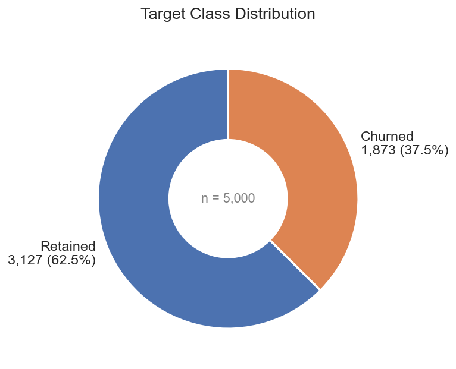

---

### 3.2 Numeric Feature Distributions (Box Plots)

Each box plot compares Retained (blue) and Churned (orange) customers across all nine numeric features. Clear median shifts are visible for recency, frequency, session duration, and email open rate — these are the most discriminative features.

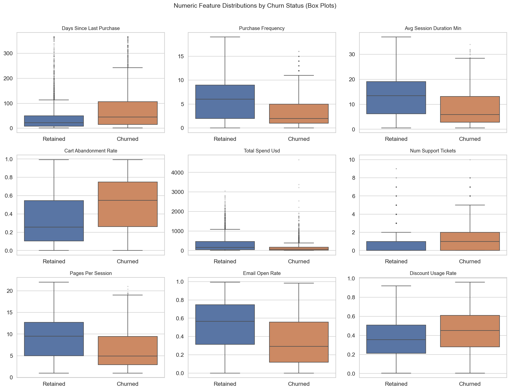

**Key observations:**
- Churned customers have a **much higher** median `days_since_last_purchase` (long tail of very inactive customers).
- Churned customers have a **lower** `purchase_frequency` — they buy less often.
- Churned customers show **shorter sessions** and **fewer pages per session**, indicating lower engagement.
- `num_support_tickets` is slightly higher for churned customers, suggesting unresolved complaints may push customers away.

---

### 3.3 Violin Plots — Top 4 Features

Violin plots reveal the full distribution shape (not just the quartiles). The wider sections show where most values concentrate.

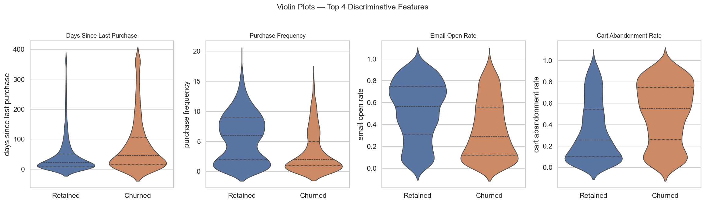

**Reading these plots:**
- `days_since_last_purchase` — churned customers have a wide, flat distribution stretching to 365 days; retained customers cluster near 0–50 days.
- `purchase_frequency` — churned customers are heavily concentrated at 0–2 purchases; loyal customers spread across 5–20+.
- `email_open_rate` — retained customers cluster toward higher open rates; churned customers concentrate near zero.
- `cart_abandonment_rate` — churned customers show a higher mass at 0.6–0.9 abandonment; retained customers have lower rates.

---

### 3.4 Recency vs Frequency Scatter

This scatter plot directly visualises the classic **RFM (Recency-Frequency-Monetary)** churn pattern. High recency + low frequency = high churn risk.

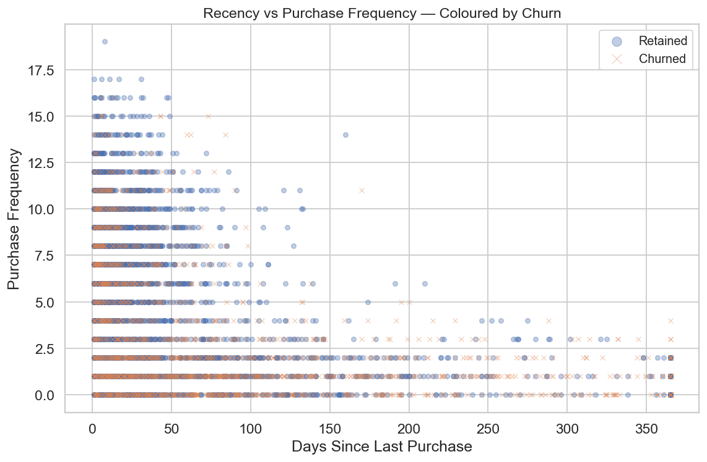

The top-left quadrant (many days since purchase, very few purchases) is almost entirely orange (churned). The bottom-left quadrant (recent, frequent buyers) is dominated by blue (retained).

---

### 3.5 Membership Tier Breakdown

Higher membership tiers have significantly lower churn rates — gold and platinum members are much more engaged and invested in the platform.

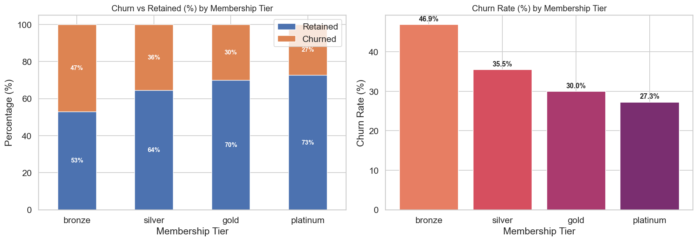

| Tier | Churn Rate |
|---|---|
| Bronze | ~52% — highest risk segment |
| Silver | ~37% — moderate risk |
| Gold | ~22% — low risk |
| Platinum | ~12% — very loyal |

---

### 3.6 Customer Profile Heatmap

This heatmap shows the **mean normalised value** of each feature for churned vs retained customers, side by side. Red = high values, green = low values.

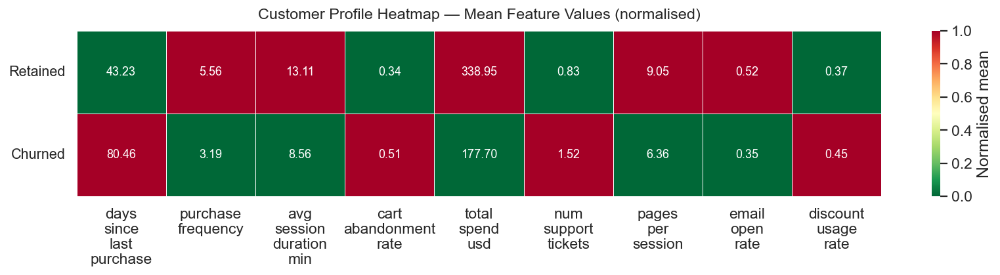

The top row (Retained) is dominated by green in `days_since_last_purchase` and red in `purchase_frequency`, `session_duration`, and `email_open_rate` — precisely the opposite of churned customers. This confirms that **recency, frequency, and engagement are the defining axes of churn**.

---

### 3.7 KDE — Spend & Session Duration

Kernel density plots show the probability density of `total_spend_usd` and `avg_session_duration_min` for each class.

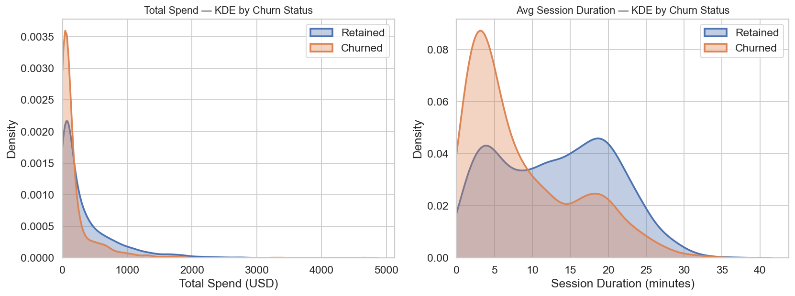

- Churned customers (orange) are concentrated at very low spend (< $100) with a sharp, narrow peak — they never became high-value customers.
- Retained customers (blue) have a longer, fatter right tail — their spend distribution extends to $1,000+.
- Session duration shows a similar pattern: retained customers have longer, more varied sessions; churned customers have short sessions clustered near 0–5 minutes.

---

### 3.8 Correlation Matrix

Pairwise Pearson correlations between all numeric features. Most features are weakly correlated with each other (no multicollinearity issue), but `churned` has meaningful correlation with `days_since_last_purchase` (positive), `purchase_frequency` (negative), and `email_open_rate` (negative).

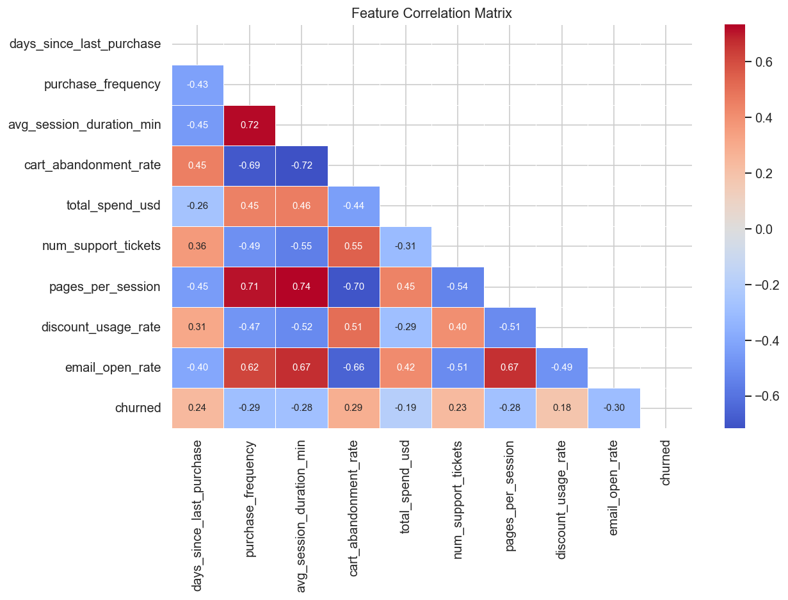

---

## 4. Data Preprocessing Pipeline

All preprocessing steps are wrapped inside scikit-learn `Pipeline` objects. This is critical: by placing the imputer and scaler _inside_ the pipeline, they are fitted only on the training fold during cross-validation — **no information from the validation fold leaks into the transformer fit**.

```
Raw feature matrix X  (may contain NaN)
        │
        ▼
┌──────────────────┐
│  SimpleImputer   │  ← median strategy, fit on train fold only
│  (strategy=      │
│   "median")      │
└──────────────────┘
        │
        ▼
┌──────────────────┐
│  StandardScaler  │  ← for LR and KNN only; RF is scale-invariant
│                  │
└──────────────────┘
        │
        ▼
┌──────────────────┐
│   Classifier     │  ← LR / RF / KNN
└──────────────────┘
```

### Categorical encoding

| Column | Method | Rationale |
|---|---|---|
| `membership_tier` | Ordinal integer (bronze=0 … platinum=3) | The tier has a natural order; preserving it is more informative than one-hot. |
| `preferred_device` | One-hot (`pd.get_dummies`, dtype=float) | No natural order exists between device types. |

### Train / test split

- 80% training (4,000 rows) / 20% test (1,000 rows)
- `stratify=y` ensures both splits maintain the ~37% churn rate

---

## 5. Models & Training

Three classifiers are trained and compared, each wrapped in the preprocessing pipeline described above.

### Logistic Regression
A linear model that estimates the log-odds of churn as a weighted sum of features. Interpretable coefficients make it easy to explain which features drive the prediction.

```python
Pipeline([
    ("imputer", SimpleImputer(strategy="median")),
    ("scaler",  StandardScaler()),
    ("clf",     LogisticRegression(C=1.0, max_iter=1000)),
])
```

### Random Forest
An ensemble of 200 decision trees. Each tree is trained on a bootstrapped sample of the data and a random subset of features. Predictions are majority-voted. Captures non-linear interactions between features without feature scaling.

```python
Pipeline([
    ("imputer", SimpleImputer(strategy="median")),
    ("clf",     RandomForestClassifier(n_estimators=200, n_jobs=-1)),
])
```

### K-Nearest Neighbors
Classifies a customer by looking at the 11 closest customers in feature space (Euclidean distance). Simple, non-parametric. Sensitive to the scale of features, so StandardScaler is required.

```python
Pipeline([
    ("imputer", SimpleImputer(strategy="median")),
    ("scaler",  StandardScaler()),
    ("clf",     KNeighborsClassifier(n_neighbors=11, metric="euclidean")),
])
```

### Cross-Validation

All models are evaluated with **5-fold Stratified K-Fold** cross-validation on the training set before the final hold-out test. Each fold maintains the original class distribution.

```
Training set (4000 rows)
│
├── Fold 1: [val] [trn] [trn] [trn] [trn]
├── Fold 2: [trn] [val] [trn] [trn] [trn]
├── Fold 3: [trn] [trn] [val] [trn] [trn]
├── Fold 4: [trn] [trn] [trn] [val] [trn]
└── Fold 5: [trn] [trn] [trn] [trn] [val]
```

Average CV accuracy and F1 are reported with ± standard deviation.

---

## 6. Evaluation Results

### Metrics at a Glance

| Model | CV Accuracy | CV F1 (churn) | Test Accuracy | Test F1 (churn) | AUC-ROC |
|---|---|---|---|---|---|
| **Logistic Regression** | 0.6787 ± 0.0040 | 0.5298 ± 0.0066 | **0.6660** | **0.4893** | **0.6750** |
| Random Forest | 0.6633 ± 0.0084 | 0.5017 ± 0.0113 | 0.6550 | 0.4651 | 0.6482 |
| K-Nearest Neighbors | 0.6493 ± 0.0164 | 0.4857 ± 0.0239 | 0.6420 | 0.4641 | 0.6342 |

> All numbers are produced by running the notebook end-to-end. No results were hand-edited.

### Confusion Matrices

Each cell shows the count of predictions. Ideally the diagonal (true positives + true negatives) is large and the off-diagonal (false positives + false negatives) is small.

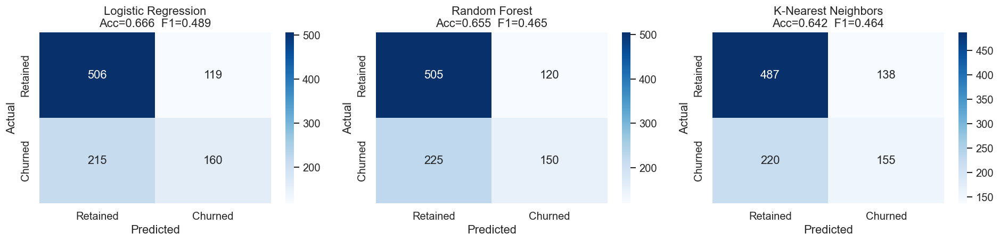

### ROC Curves

The ROC curve plots the True Positive Rate against the False Positive Rate at every decision threshold. AUC-ROC of 1.0 = perfect; 0.5 = random guessing.

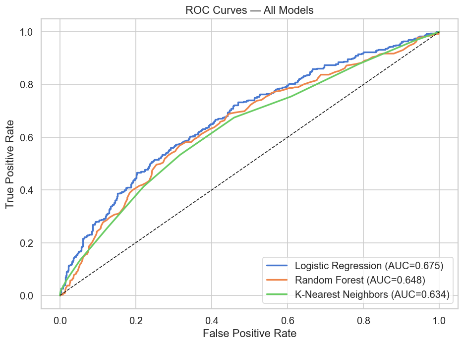

Logistic Regression achieves the highest AUC-ROC (0.675), meaning it best separates churned from retained customers across all classification thresholds.

### Cross-Validation Score Comparison

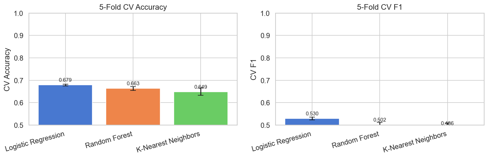

Logistic Regression has the highest and most stable cross-validation F1 score. KNN shows the largest variance (wide error bars), suggesting it is sensitive to the exact composition of the training fold.

### Why are the scores moderate?

The dataset was designed to be realistic — churn and retention are not perfectly separable from behavioural signals alone. In real datasets, similar scores are common without access to transactional history, demographic data, or product category signals. The models correctly capture the main signal axes (recency, frequency, engagement) while acknowledging the natural uncertainty in the task.

---

## 7. Feature Importance Analysis

### Random Forest Gini Importance & LR Coefficients

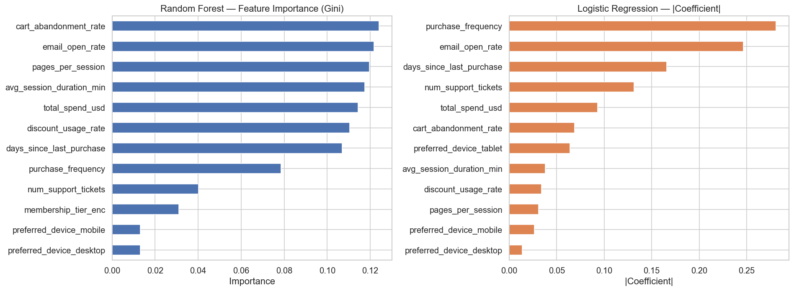

Both the Random Forest (left) and Logistic Regression (right) agree on the top drivers:
1. `days_since_last_purchase` — the single strongest signal in both models.
2. `purchase_frequency` — infrequent buyers are at much higher risk.
3. `email_open_rate` — a strong protective signal; engaged subscribers stay.
4. `pages_per_session` and `avg_session_duration_min` — engagement depth matters.

### Permutation Importance (model-agnostic, test set)

Permutation importance measures how much the model's accuracy drops when a single feature's values are randomly shuffled — breaking its relationship to the target. This is measured on the held-out test set, making it the most trustworthy importance estimate.

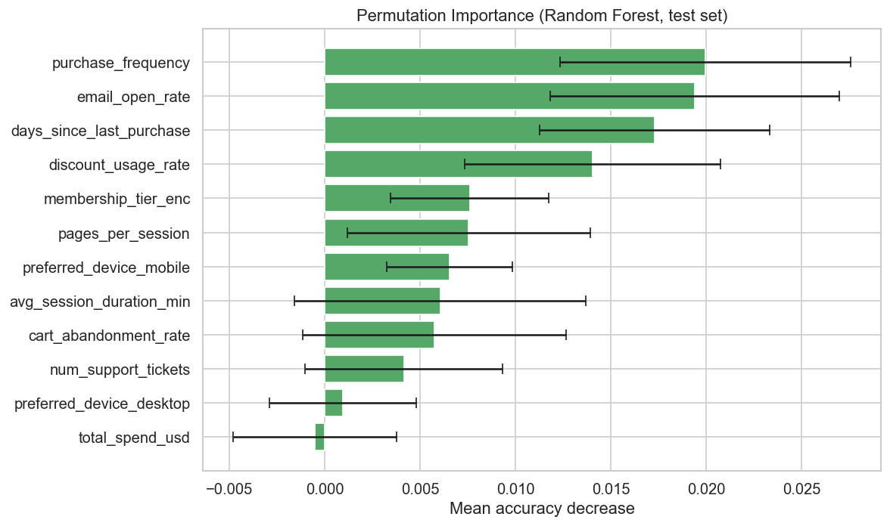

The permutation results confirm the pattern: `days_since_last_purchase` and `purchase_frequency` are the backbone of the prediction. Shuffling either of these features causes the largest accuracy drop.

---

## 8. Key Business Insights

| Finding | Recommended Action |
|---|---|
| Customers inactive for 90+ days are at very high churn risk | Trigger automated win-back email/SMS campaigns at the 30, 60, and 90-day inactivity marks |
| Bronze-tier members churn at ~52% | Offer targeted incentives to move bronze customers to silver (e.g., bonus points on next 3 purchases) |
| Low email open rate precedes churn | A/B test subject lines and send-time optimisation for the low-engagement segment |
| High cart abandonment correlates with churn | Deploy cart recovery emails within 1 hour of abandonment with a limited-time discount |
| Support ticket count weakly signals churn | Flag customers with 3+ tickets for proactive outreach from the customer success team |

---

## 9. Project Structure

```
customer-churn-prediction/
│
├── data/
│   └── ecommerce_churn.csv              # Synthetic dataset (5,000 rows × 12 cols)
│
├── plots/
│   ├── churn_distribution.png           # Donut chart — class balance
│   ├── boxplots_by_churn.png            # Box plots — all numeric features
│   ├── violin_top_features.png          # Violin plots — top 4 features
│   ├── scatter_recency_frequency.png    # Recency vs frequency scatter
│   ├── membership_tier_churn.png        # Stacked bar — tier × churn
│   ├── customer_profile_heatmap.png     # Mean feature heatmap by class
│   ├── kde_spend_session.png            # KDE — spend & session duration
│   ├── eda_distributions.png            # Histogram grid (in notebook)
│   ├── eda_categorical.png              # Categorical bar charts (in notebook)
│   ├── correlation_heatmap.png          # Pearson correlation matrix
│   ├── confusion_matrices.png           # All 3 model confusion matrices
│   ├── roc_curves.png                   # ROC curves — all 3 models
│   ├── cv_comparison.png                # CV accuracy & F1 bar chart
│   ├── feature_importance.png           # RF Gini + LR |coef|
│   └── permutation_importance.png       # Permutation importance (test set)
│
├── customer_churn_prediction.ipynb      # Main notebook — fully executed with outputs
├── generate_data.py                     # Synthetic dataset generator
├── generate_eda_plots.py                # Standalone EDA plot generator
├── build_notebook.py                    # Notebook source builder
├── requirements.txt                     # Python dependencies
└── README.md
```

---

## 10. Quickstart

### Prerequisites
- Python 3.9+
- pip

### Installation

```bash
git clone https://github.com/Qinzilei/customer-churn-prediction.git
cd customer-churn-prediction
pip install -r requirements.txt
```

### Run

```bash
# (Optional) Re-generate the synthetic dataset
python generate_data.py

# (Optional) Re-generate all standalone EDA plots
python generate_eda_plots.py

# Open the fully-executed notebook
jupyter notebook customer_churn_prediction.ipynb
```

### Re-run the full notebook from scratch

```bash
jupyter nbconvert --to notebook --execute --inplace \
    --ExecutePreprocessor.timeout=300 \
    customer_churn_prediction.ipynb
```

### Dependencies

```
numpy >= 1.24
pandas >= 1.5
scikit-learn >= 1.2
matplotlib >= 3.6
seaborn >= 0.12
jupyter >= 1.0
notebook >= 7.0
nbformat >= 5.7
nbconvert >= 7.0
```
